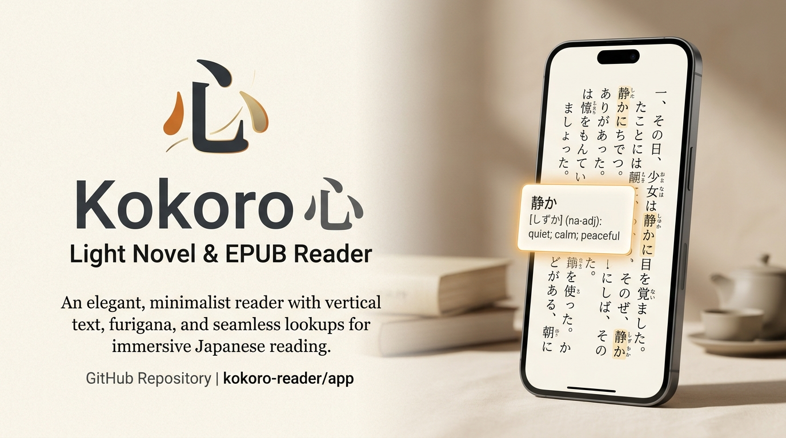
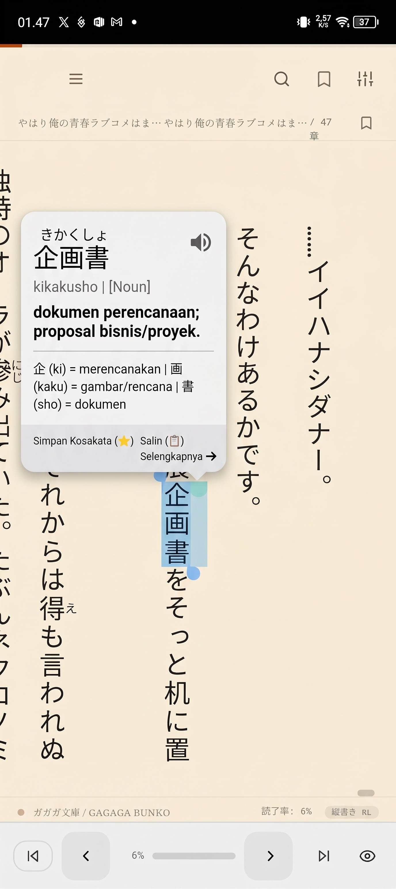

<p align="center">
  
</p>

<h1 align="center">心 Kokoro — Light Novel & EPUB Reader</h1>

<p align="center">
  <strong>Pustaka & Pembaca Light Novel / EPUB Offline-First bergaya Play Books & Kindle dengan Tategaki Vertikal Jepang (縦書き), Kamus Cepat Tap-to-Lookup Multi-Tier, dan Asisten Belajar AI & SRS.</strong>
</p>

<p align="center">
  <a href="https://github.com/KianaSus/Baca-LN"></a>
  <a href="LICENSE"></a>
  
  
  
  
  
  
</p>

<p align="center">
  <a href="#-fitur-unggulan">Fitur Unggulan</a> •
  <a href="#-tangkapan-layar">Tangkapan Layar</a> •
  <a href="#-mulai-cepat-30-detik">Mulai Cepat</a> •
  <a href="#-shortcut-keyboard">Shortcut Keyboard</a> •
  <a href="#-build-aplikasi-native">Build Native</a> •
  <a href="#-arsitektur-proyek">Arsitektur</a> •
  <a href="#-faq">FAQ</a> •
  <a href="#-english-summary">English</a>
</p>

---

##  Tentang Kokoro

**Kokoro (心)** dirancang khusus bagi pecinta Light Novel dan pembelajar bahasa Jepang yang mendambakan pengalaman membaca buku fisik (*Bunkobon*) langsung di perangkat digital mereka. 

Aplikasi ini beroperasi **100% offline-first** tanpa ketergantungan CDN atau server luar: mulai dari rendering teks vertikal otentik (*tategaki*), ekstraksi sampul otomatis, kamus berlapis bahasa Indonesia sekali ketuk, deteksi kata majemuk & nama diri, kartu kanji, hingga sistem kuis pengulangan berjarak (SRS) yang terintegrasi langsung dengan novel Anda. Untuk pemahaman mendalam, tersedia pula opsi asisten terjemahan & bedah nuansa kalimat bertenaga AI (Gemini / OpenAI).

---

## 📸 Tangkapan Layar

<div align="center">
  <table>
    <tr>
      <th align="center" width="45%">📚 Pustaka Modern & Rak Custom</th>
      <th align="center" width="45%">📖 Tategaki Vertikal & Kamus Tap-to-Lookup</th>
    </tr>
    <tr>
      <td align="center" valign="top">
        
        <br><br>
        <em>Manajemen koleksi buku, sampul otomatis, rak tag kustom, status membaca, dan pencarian instan.</em>
      </td>
      <td align="center" valign="top">
        
        <br><br>
        <em>Format vertikal Jepang (縦書き) dengan furigana, popup kamus instan (arti ID/EN berlapis, romaji, bedah kanji, audio TTS), dan simpan kosakata.</em>
      </td>
    </tr>
  </table>
</div>

---

## 🌟 Fitur Unggulan

### 🇯🇵 1. Pengalaman Membaca Vertikal Otentik (縦書き)
- **Tategaki Vertikal & Horizontal:** Beralih mulus antara orientasi vertikal khas novel Jepang (kanan ke kiri / RTL) dan horizontal klasik.
- **Furigana Pintar (Smart Ruby):** 
  - *Semua:* Menampilkan seluruh furigana.
  - *Pintar:* Furigana untuk kosakata yang sudah Anda hafal/simpan akan memudar; cukup ketuk untuk mengintip selama 1,4 detik.
  - *Mati:* Sembunyikan seluruh furigana untuk melatih kemampuan membaca kanji murni.
- **Tate-Chu-Yoko Otomatis:** Angka 2 digit dan tanda baca otomatis diformat tegak horizontal di dalam kolom vertikal.
- **Dukungan Ilustrasi Penuh:** Ilustrasi light novel disajikan anggun sebagai halaman tersendiri atau galeri lightbox sekali sentuh.

### 🔍 2. Kamus Cepat Tap-to-Lookup Multi-Tier (Immersion Reading)
- **Sekali Ketuk:** Aktifkan **Mode Kamus**, lalu ketuk kata apa saja di halaman buku untuk menampilkan popover kamus tanpa memutus alur membaca.
- **🇮🇩 Arti Indonesia Berlapis:** Tiap kata dicari bertingkat secara cerdas:
  1. **🇮🇩 Kurasi N5:** Definisi terkurasi presisi untuk pembelajar tingkat dasar.
  2. **🇮🇩 Wikikamus Indonesia:** Entri definisi bahasa Indonesia dari Wikikamus (`vendor/ja-id.json`).
  3. **≈ Jembatan ~Gloss ID:** Terjemahan leksikal kata frekuensi tinggi (`vendor/en-id.json`) yang dilabeli transparan.
  4. **🇬🇧 JMdict Lengkap:** Database komprehensif hingga 218.000+ entri bahasa Jepang-Inggris.
- **🧩 Deteksi Kata Majemuk (Compound Words):** Ketuk bagian mana saja dari kata majemuk (misalnya: `実行委員会`), Kokoro otomatis mencocokkan bentuk gabungan terpanjang terlebih dahulu.
- **👤 Deteksi Nama Karakter / Tempat (Nama Diri):** Token nama (seperti `比企谷` / `雪ノ下`) otomatis ditandai sebagai 👤 *“Kemungkinan nama diri”* lengkap dengan bacaan romaji & kanji breakdown tanpa membebani ukuran aplikasi.
- **Bedah Kanji & Konjugasi:** Menampilkan akar kata dari bentuk konjugasi (misal: `よむ` dari bentuk `～て`) serta bedah arti kanji per karakter.
- **Audio Pelafalan Asli (TTS):** Dengarkan pelafalan kata dengan tombol 🔊 normal dan 🐢 kecepatan santai (0.6x).

### 🤖 3. Penerjemah Kalimat & Asisten AI (✨ Fitur Jelaskan)
- **Mode Fleksibel:**
  - *Otomatis (Default):* Menggunakan provider online jika terhubung internet, dan otomatis beralih ke rakitan offline jika tanpa koneksi.
  - *Murni Offline:* Merakit arti harfiah kata-per-kata sesuai urutan kalimat Jepang asli.
  - *Online:* Memastikan hasil terjemahan kalimat yang alami.
- **Multi-Provider Pilihan:**
  - **MyMemory:** Bawaan gratis, siap pakai tanpa API key.
  - **Google Gemini:** Terjemahan cerdas berbasis konteks (masukkan API key Anda di Pengaturan).
  - **OpenAI-Compatible:** Dukungan penuh untuk model OpenAI, OpenRouter, DeepSeek, maupun Local LLM (Ollama) dengan custom Base URL & API Key.
- **✨ Fitur Jelaskan (AI Nuance & Grammar Breakdown):** Tombol *Jelaskan* memanggil LLM untuk membedah nuansa emosional/sastra, idiom tersirat, dan struktur tata bahasa kalimat langsung dalam bahasa Indonesia.
- **Hemat Token & Privasi Terjaga:** Seluruh hasil terjemahan dan penjelasan di-cache di perangkat (tidak membuang kuota API jika dibuka berulang). Kunci API tersimpan eksklusif di `localStorage` lokal dan tidak pernah disertakan ke dalam berkas cadangan pustaka.

### 🧠 4. Spaced Repetition System (SRS) & Kosakata Terintegrasi
- **Konteks Nyata Buku:** Setiap kata yang disimpan otomatis menyertakan **1 kalimat utuh** dari light novel yang sedang Anda baca!
- **Kuis Harian 4 Mode:**
  1. *Jepang ➔ Arti* (Memahami makna)
  2. *Bacaan ➔ Kanji* (Menghafal bentuk kanji)
  3. *Audio ➔ Arti* (Latihan mendengarkan)
  4. *Isi Kalimat Rumpang* (Menguji pemahaman konteks)
- **Algoritma SM-2:** Penilaian mandiri (😅 Lupa / 🤔 Ragu / 😄 Tahu) dengan interval adaptif untuk retensi memori jangka panjang.
- **Gamifikasi:** Pertahankan **Streak Harian 🔥** dan kumpulkan **XP ✨** setiap kali menyelesaikan sesi review harian.
- **Ekspor ke Anki:** Ekspor seluruh kosakata Anda ke format TSV siap pakai untuk Anki (lengkap dengan kalimat konteks, romaji, JLPT, dan tingkat penguasaan).

### 🎨 5. Estetika Bunkobon & Tema Kertas Tradisional
- **5 Preset Kertas Klasik:** *Bunkobon* (kertas novel hangat), *Washi Murni* (tekstur lembut), *Amber* (nyaman di mata), *Sakura Pink* (lembut), dan *OLED Black* (hemat daya).
- **Kustomisasi Luas:** Atur tema isi dan antarmuka luar secara terpisah, ubah jenis font lokal, ukuran teks, jarak antar baris/kolom, hingga animasi pembalikan halaman (Snap / Mulus).

### 📴 6. 100% Offline-First & Privasi Terjamin
- **Nol CDN & Server Luar:** Semua pustaka (Tailwind, JSZip, Lucide, Font WOFF2, Kamus N5, Wikikamus JA-ID, Jembatan EN-ID) tersimpan lokal di dalam folder `vendor/`.
- **Penyimpanan Lokal:** File buku, riwayat, dan bookmark tersimpan aman di IndexedDB perangkat Anda.
- **Backup & Restore Fleksibel:** Cadangkan seluruh data Anda dalam file JSON atau ekspor kembali file `.epub` kapan saja.

---

## ⚡ Mulai Cepat (30 Detik)

### Cara 1: Tanpa Instalasi (Paling Mudah)
Cukup unduh repositori ini, lalu **klik ganda file `index.html`** di browser Chrome, Edge, Safari, atau Firefox favorit Anda. Semua fitur langsung berjalan!

### Cara 2: Menjalankan Local Web Server (Direkomendasikan untuk PWA)
Menjalankan lewat web server lokal mengaktifkan fitur Service Worker (PWA installable & caching):

```powershell
# Masuk ke folder proyek
cd LN_Reader

# Pasang dependensi dev
npm install --ignore-scripts

# Jalankan server lokal (pilih salah satu)
npx serve -l 5173 .
# atau gunakan Python bawaan:
python -m http.server 5173
```
Buka browser Anda di `http://localhost:5173/index.html`.

---

## ⌨️ Shortcut Keyboard

Navigasi membaca menjadi sangat cepat saat menggunakan laptop atau keyboard eksternal:

| Tombol | Fungsi |
|:---:|---|
| `←` / `→` | Membalik halaman ke kiri / ke kanan (menyesuaikan mode arah baca) |
| `V` | Beralih antara mode vertikal (**縦書き**) dan horizontal (**横書き**) |
| `F` | Mode Fokus (menyembunyikan seluruh header & navigasi) |
| `B` | Menambah atau menghapus Bookmark pada posisi saat ini |
| `Ctrl + F` | Membuka pencarian teks di dalam bab yang aktif |
| `1` - `4` | Memilih opsi jawaban pada Kuis SRS Kosakata |
| `1` - `3` | Menilai kartu review SRS (1: Lupa, 2: Ragu, 3: Tahu) |
| `Esc` | Menutup modal, kamus, atau panel pengaturan |

> 💡 *Panduan posisi tombol lengkap di layar sentuh ponsel dapat dilihat di [docs/FITUR.md](docs/FITUR.md).*

---

## 📱 Build Aplikasi Native

Kokoro siap dikemas menjadi aplikasi native Android (.APK) atau Desktop (.EXE):

### Build APK Android (Capacitor)
```powershell
# 1. Siapkan aset web ke direktori dist/
node scripts/copy-dist.cjs

# 2. Sinkronisasikan dengan proyek Android
npx cap sync android

# 3. Buka di Android Studio untuk Build APK / Run ke HP
npx cap open android
```

### Build Desktop (Electron / Tauri)
```powershell
# Menjalankan versi Electron di desktop
npm run electron:dev

# Menjalankan versi Tauri (opsional)
npm run tauri:dev
```

*Panduan lengkap langkah demi langkah dapat dibaca di [docs/BUILD.md](docs/BUILD.md).*

---

## 📂 Struktur Proyek

```
LN_Reader/
├── index.html              # Aplikasi utama (HTML, CSS, dan logika mandiri)
├── vendor/                 # Pustaka lokal & database kamus
│   ├── jlpt-n5.json        # Database kamus N5
│   ├── id-gloss-n5.json    # Terjemahan gloss bahasa Indonesia (N5)
│   ├── ja-id.json          # Kamus Jepang-Indonesia (Wikikamus)
│   ├── en-id.json          # Jembatan leksikal Inggris-Indonesia
│   ├── jmdict-full.json    # Kamus JMdict lengkap (opsional/dibangun)
│   ├── kana-map.json       # Pemetaan hiragana/katakana & rōmaji
│   └── kanjivg-n5/         # Stroke SVG kanji N5
├── docs/                   # Dokumentasi teknis & aset
│   ├── assets/             # Banner visual & tangkapan layar
│   ├── FITUR.md            # Direktori posisi tiap tombol & fitur
│   ├── ARSITEKTUR.md       # Pemetaan fungsi kode & database
│   ├── ATRIBUSI-DATA.md    # Lisensi & sumber data kamus
│   └── BUILD.md            # Panduan build APK & Desktop
├── assets/ & icons/        # Aset ikon resolusi tinggi & vektor
├── scripts/                # Script pengujian, build kamus, dan dist
│   ├── check.cjs           # Uji kepatuhan offline & sintaks
│   ├── verify-ja-id.cjs    # Verifikasi integritas kamus JA-ID
│   ├── verify-en-id.cjs    # Verifikasi integritas jembatan EN-ID
│   ├── build-dict.cjs      # Builder kamus JMdict (ringkas / full)
│   ├── build-ja-id.cjs     # Crawler/builder Wikikamus JA-ID
│   └── copy-dist.cjs       # Bundler folder dist untuk native APK
├── manifest.webmanifest    # Konfigurasi Progressive Web App (PWA)
├── sw.js                   # Service Worker untuk offline caching
└── capacitor.config.json   # Konfigurasi pembungkus Android Capacitor
```

---

## 🛠️ Uji Kualitas & Manajemen Kamus

Jalankan rangkaian tes untuk memastikan kode bersih, tidak ada ID yang hilang, dan integritas data kamus terjaga:

```powershell
# 1. Pemeriksaan kesehatan umum (offline, sintaks, ID HTML)
npm run check

# 2. Uji fungsi dan logika SRS & kamus
npm run smoke

# 3. Verifikasi integritas kamus
npm run verify:n5
npm run verify:ja-id
npm run verify:en-id

# 4. (Opsional) Membangun database JMdict lengkap untuk APK
npm run build:dict:full
```

---

## ❓ FAQ (Pertanyaan yang Sering Diajukan)

<details>
<summary><strong>Di mana file buku dan progres baca saya disimpan?</strong></summary>
Semua buku, sampul, posisi baca, dan catatan kosakata disimpan secara lokal di dalam browser Anda menggunakan teknologi <code>IndexedDB</code> (database <code>kokoroLibraryDB</code>) serta <code>localStorage</code>. Data Anda bersifat privat dan tidak pernah diunggah ke internet.
</details>

<details>
<summary><strong>Apakah saya membutuhkan koneksi internet untuk membaca?</strong></summary>
Tidak. Kokoro berarsitektur <em>Offline-First</em>. Seluruh font, ikon, pengurai EPUB, serta data kamus (N5, Wikikamus JA-ID, EN-ID, JMdict) tersimpan internal di folder <code>vendor/</code>. Koneksi internet hanya dibutuhkan jika Anda memilih menggunakan terjemahan online atau asisten AI LLM.
</details>

<details>
<summary><strong>Apakah aman memasukkan API Key Gemini / OpenAI di Kokoro?</strong></summary>
Sangat aman. API key Anda disimpan <strong>hanya di <code>localStorage</code> perangkat</strong> Anda sendiri dengan input bertipe password. API key <em>tidak akan pernah</em> disertakan ke dalam file JSON cadangan pustaka saat Anda mengekspor data.
</details>

<details>
<summary><strong>Bagaimana cara memindahkan data ke perangkat lain?</strong></summary>
Gunakan fitur cadangkan! Di halaman utama pustaka, buka menu <code>⋮ (Lainnya)</code> di pojok kanan atas, lalu pilih <strong>Cadangkan</strong> untuk mengunduh berkas JSON. Di perangkat baru, pilih <strong>Pulihkan</strong> dan pilih berkas tersebut.
</details>

<details>
<summary><strong>Apakah aplikasi ini mendukung format selain EPUB?</strong></summary>
Saat ini Kokoro berfokus memberikan pengalaman terbaik untuk format <code>.epub</code> (standar format light novel digital). File EPUB dapat langsung diimpor sekaligus banyak (multi-file) atau cukup di-drag & drop ke halaman.
</details>

---

## 🌐 English Summary

**Kokoro (心)** is an elegant, offline-first Light Novel & EPUB reader and Japanese immersion companion inspired by Google Play Books and Amazon Kindle.

### Key Highlights:
- **Authentic Tategaki (縦書き):** Read vertical Japanese text from right to left (RTL) with smart ruby/furigana control, automatic tate-chu-yoko for numbers, and full-bleed illustration support.
- **Multi-Tier Tap-to-Lookup:** Tap any Japanese word to inspect definitions via a prioritized tiered pipeline:
  1. *Curated N5 Indonesian*
  2. *Indonesian Wiktionary entries (`vendor/ja-id.json`)*
  3. *English-Indonesian lexical bridge (`vendor/en-id.json`)*
  4. *Complete English JMdict (up to 218k+ entries)*
- **Smart Compound & Name Recognition:** Automatically identifies longest-match compound phrases (e.g. `実行委員会`) and character/place names (`名詞+固有名詞`, e.g. `比企谷`) without inflating app size.
- **AI Sentence Translation & ✨ Explanations:**
  - Online / Offline modes (literal grammar-ordered reconstruction when offline).
  - Providers: MyMemory (free, zero-config), Google Gemini, or any OpenAI-compatible API (OpenRouter, DeepSeek, Local Ollama).
  - *✨ Explain Feature:* Ask AI to dissect sentence nuance, subtext, and grammatical rules in Indonesian.
  - On-device caching and private API key storage in `localStorage`.
- **Spaced Repetition System (SRS):** Save words with real 1-sentence context directly from the chapter you are reading. Review daily using the SM-2 algorithm with 4 quiz modes, daily streaks, XP, and Anki TSV export.
- **Traditional Bunkobon Aesthetics:** Choose from 5 classic paper presets (Bunkobon, Pure Washi, Amber, Sakura Pink, OLED Black) or customize your own theme.
- **100% Offline & Private:** Zero CDN dependencies. Books, progress, and vocabulary are stored locally in IndexedDB.
- **Cross-Platform:** Runs seamlessly as a standalone browser app, installable PWA, native Android APK (via Capacitor), or Desktop application (via Electron/Tauri).

For technical details and contribution guidelines, see [docs/ARSITEKTUR.md](docs/ARSITEKTUR.md) and [CONTRIBUTING.md](CONTRIBUTING.md).

---

## 🤝 Berkontribusi & Lisensi

Kami menyambut kontribusi dalam bentuk pelaporan bug, usulan fitur, maupun pull request!
- Panduan berkontribusi: **[CONTRIBUTING.md](CONTRIBUTING.md)**
- Panduan keamanan: **[SECURITY.md](SECURITY.md)**
- Atribusi data: **[docs/ATRIBUSI-DATA.md](docs/ATRIBUSI-DATA.md)**

Proyek ini dirilis di bawah lisensi terbuka **[MIT License](LICENSE)**.

<p align="center">
  Dibuat dengan ❤️ untuk komunitas pembaca Light Novel dan pembelajar bahasa Jepang.
</p>
