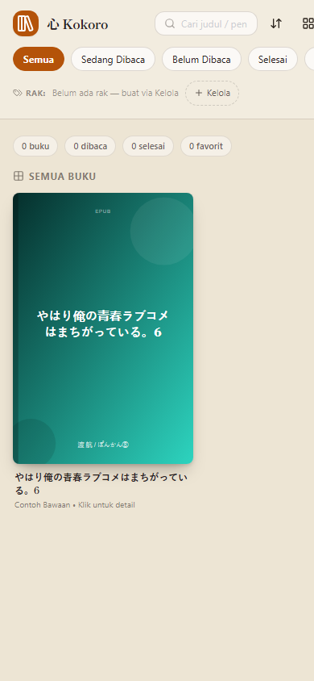

# 心 Kokoro — Light Novel & EPUB Reader

Pustaka dan pembaca Light Novel / EPUB **offline-first** ala Play Books & Kindle:
tategaki vertikal Jepang (縦書き), mode horizontal, sampul, rak custom, dan progres
yang tersimpan otomatis di perangkat.



> Bahasa: panduan utama berbahasa Indonesia. English summary at the bottom.

## Fitur singkat

- 📚 **Pustaka** — impor banyak EPUB sekaligus (atau drag & drop), sampul otomatis,
  lanjutkan membaca, favorit, selesai, rating ★, pencarian judul/penulis/rak.
- 🗂️ **Rak custom** — tag bebas per buku, filter chip, kelola (buat/ubah/hapus).
- 📖 **Reader tategaki** — vertikal Jepang + horizontal, furigana (ruby),
  tate-chu-yoko angka otomatis, ilustrasi jadi halaman khusus, Snap/Mulus per-layar.
- 🎨 **Tema luar & dalam** — 5 tema kertas + warna kustom, bisa disamakan atau dibedakan.
- 💾 **Auto-save** — posisi baca, bookmark, dan galeri ilustrasi per buku (IndexedDB);
  backup/pulihkan metadata via JSON + ekspor EPUB per buku.
- 📴 **Full-offline** — tanpa CDN: `vendor/` berisi Tailwind, JSZip, Lucide, dan font.
- 📱 **Siap native** — PWA installable + wrapper Capacitor (APK) / Electron (EXE).

Panduan lengkap per fitur: **[docs/FITUR.md](docs/FITUR.md)** (di mana letak tiap tombol).

## Mulai cepat (30 detik)

Butuh: Node.js ≥ 18 (`node --version`).

```powershell
cd LN_Reader
npm install --ignore-scripts   # sekali saja ( bloody electron ditunda )
npx serve -l 5173 .            # atau: python -m http.server 5173
# buka http://localhost:5173/index.html
```

Tanpa server pun bisa: klik ganda `index.html` (hanya Service Worker yang nonaktif).
Cek kesehatan proyek kapan saja:

```powershell
npm run check
```

## Struktur repo

```
index.html              ← APLIKASI (satu file, baca/edit file ini)
vendor/                 ← lib lokal: tailwind, jszip, lucide, fonts.css + fonts/*.woff2
icons/ + assets/        ← logo SVG/PNG + sumber ikon 1024 untuk native
scripts/                ← check.cjs (uji), copy-dist.cjs (dist), gen-android-icons.ps1
manifest.webmanifest    ← PWA        sw.js ← cache offline
capacitor.config.json   ← config APK (webDir: dist)
electron-main.js        ← wrapper EXE (rencana Fase 3b)
docs/                   ← FITUR.md, ARSITEKTUR.md, BUILD.md
```

`dist/`, `android/`, `node_modules/` dibuat otomatis (di-ignore git).
Peta kode (fungsi ↔ baris): **[docs/ARSITEKTUR.md](docs/ARSITEKTUR.md)**.

## Build APK / EXE

Ringkasan — detail di **[docs/BUILD.md](docs/BUILD.md)**:

```powershell
node scripts/copy-dist.cjs                          # bangun dist/ bersih
node node_modules/@capacitor/cli/bin/capacitor sync android
# buka folder android/ di Android Studio → Run ▶ / Build APK
```

## Berkontribusi & lisensi

- Cara kontribusi: **[CONTRIBUTING.md](CONTRIBUTING.md)**.
- Keamanan: **[SECURITY.md](SECURITY.md)**.
- Lisensi **MIT** — lihat [LICENSE](LICENSE). Ikon/logo buatan sendiri di `icons/`.

## FAQ

- **Dataku tersimpan di mana?** IndexedDB `kokoroLibraryDB` + `localStorage`
  (perangkat & per browser, offline). Uninstall = data hilang → cadangkan dulu
  via menu `⋯ > Cadangkan`.
- **Butuh internet?** Tidak, kecuali saat pertama mengunduh dependensi build.
- **EPUB bergambar besar lambat?** Gambar sudah lazy/async; laporkan via Issues
  beserta judul babnya.

---

### English summary

Kokoro is an offline-first Light Novel/EPUB library & reader (Japanese vertical
tategaki + horizontal, shelves/tags, themes, auto-save) in a single `index.html`,
with PWA support and Capacitor (APK) / Electron (EXE) wrappers. MIT licensed.
See [docs/BUILD.md](docs/BUILD.md) to build, [CONTRIBUTING.md](CONTRIBUTING.md) to help.
